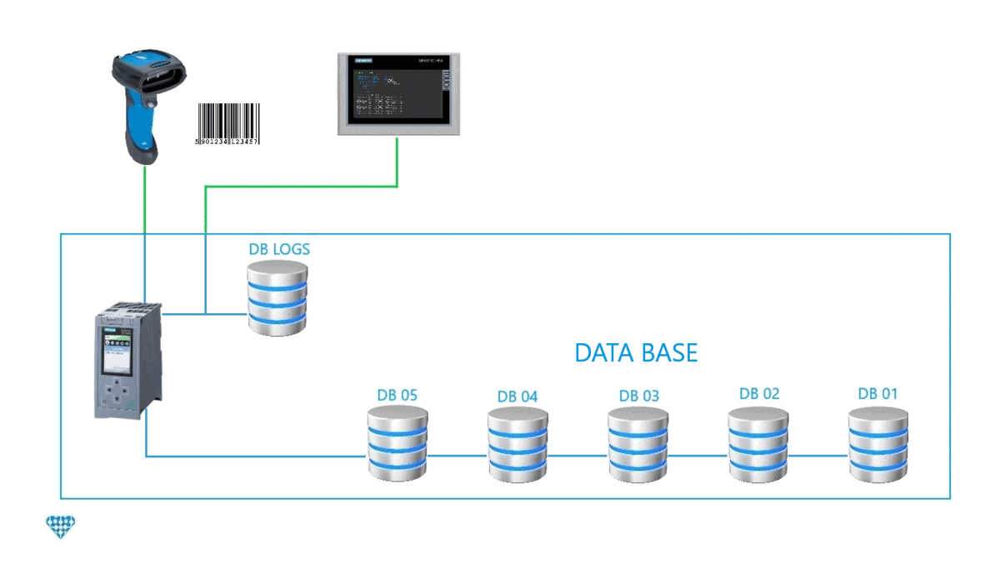

***
# S7DataLogger
***
## Table of Contents
1. [General Info](#general-info)
2. [Development Environment](#development-environment)
3. [Tested](#tested)
4. [Architecture](#architecture)
5. [Tutorial](#tutorial)
***
## General Info
The project consists of recording barcode readings. The Plc stores the data using the DB memory area, with the drawback that 1 DB and the memory capacity (work/load) of a Plc is limited. We will push the data logging memory to the limit using 5 DB, although it can be configured from 1 to 5 DB. The HMI creates a .log file on the PC. The user will be able to see from the HMI how all the records are being stored, the storage status, as well as being able to:
1.  Insert new Barcode records in the DBs. 
2.	Consult the records
3.	Delete records
4.	Create backup of the .log file
***
In order to perform the logging tests without the need of a barcode reader, I have created a function that simulates the reading of barcodes.

### Images HMI
***

    

  

    

    

    

    

***
## Development Environment
* TIA PORTAL V13
* Pc Windows 7
***
## Tested
* Plc S7 1500
* TP 1900 Comfort
***
## Architecture

***
## Package

|  | COMMENT |
| ------ | ------ |
| ArchiveProject | Plc + Hmi project.|
| Sources |  AWL + SCL + VB Script + UDT |

***
## Tutorial
Watch the video on youtube.

***

